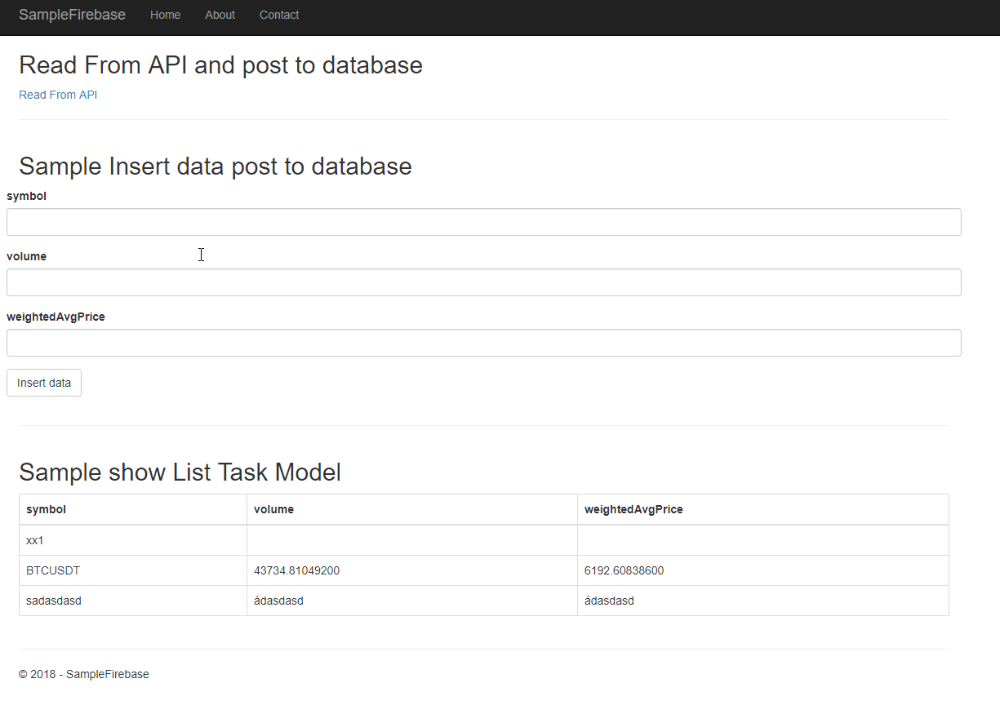

## Sample firebase dotnetcore

## Layout


### Install package
```
 <PackageReference Include="FirebaseDatabase.net" Version="3.3.3" />
```

### Config firebase
```
        // config init firebase
        private readonly string apiKey = "your api key";
        private readonly string App_secret = "your key secret";
        private readonly string authDomain = "<your project>.firebaseapp.com";
        private readonly string databaseURL = "https://<your project>.firebaseio.com";
        private readonly string projectId = "<your project id>";
        private readonly string storageBucket = "<your project>.appspot.com";
        private readonly string messagingSenderId = "<your message sender id>";
```

### Using
```
using Firebase.Database;
using Firebase.Database.Query;
```

### Auth
```
var firebase = new FirebaseClient(databaseURL, new FirebaseOptions
{
    AuthTokenAsyncFactory = () => Task.FromResult(App_secret)
});
```

### Query
```
// query from database
   var dinos = await firebase
  .Child("fir-work811")
  .OrderByKey()
  .OnceAsync<TaskModel>();
```

### Post
```
   // Post data to database
   var dino = await firebase.Child("fir-work811").PostAsync(taskModel);
```